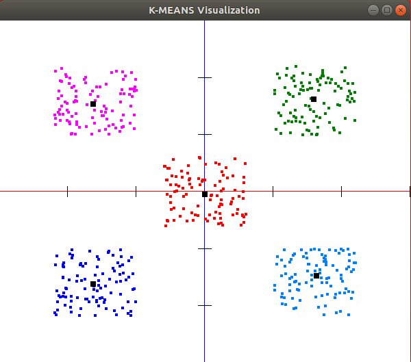

# Clustering-Algorithms

Implementation and Visualization of K-Means and LearningVectorQuantization (LVQ) Algorithms.
Grouping of a dataset in clusters. Dataset consists of 500 two-dimensional points.
Part of the course "Computational Intelligence-MYE035"/Winter semester of 2018-2019 season at [University of Ioannina](http://cs.uoi.gr/en/index.php?menu=m1).

### Implementation by:
1. Chomondozlis Paschalis
2. [Deligiannis Nikos](https://github.com/NikosDelijohn)

## K-Means

This K-Means implementation creates clusters based on the dataset that is given. The algorithm picks random points from the dataset to serve as initial centroid values. Assigns all the points to their closest cluster by find the closest centroid to them. Then the centroid coordinates are updated by taking the average values of the points that belong to that centroid. The last two steps are repeated until none of the centroids haven't moved in the last two iterations.

## LVQ

This Learning Vector Quantization on-line implementation is intended for separating large datasets into as many clusters as you want. Initialy the algorithm picks random dataset points to act as centroids. For all the dataset points, find the closest cluster and update the cluster's centroid values/coordinates with the formula:
- 
- 

where _c_ is the cluster closest to the dataset point _x_ and _η_ is the learning factor of the algorithm. We've set the learning factor to start at 0.1 and decrease by _η * 0.95_ each epoch and stop the iterations when it gets below _0.05_. The result is the dataset points to pull the centroids that are closer to them, even closer. The points that do not fall under the category above DO NOT push the centroids further away from them as the points do not have a predetermined classification before entering the neural network.

## Visualization / Results

Both implementations run the same algorithm multiple times on the same dataset in order to avoid any bad centroid initializations. The mertic that is used here is called _dispersion_ and adheres to the following formula:
- 

The simulation with the _least_ dispersion is chosen upon completion and is rendered using OpenGL.

## Usage

The programs are intended to run on Linux. You will need to have OpenGL installed on your system.
```
sudo apt-get install freeglut3-dev
```

After that, just open a terminal inside the _src_ folder of the algorithm you want to compile and type:
```
make
```
To run the actual programs type:
```
./kmeans
```
or respectively:
```
./lvq
```
You can edit the number of clusters and simulations by changing the defined values in the header files.
The centroid values are calculated and then the results are rendered.


